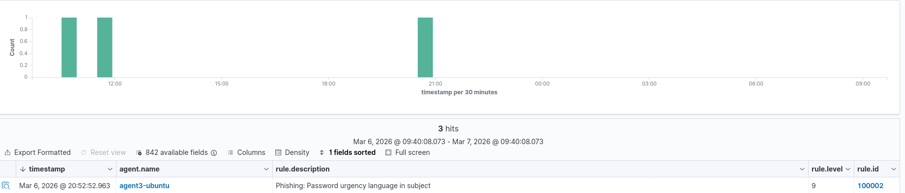
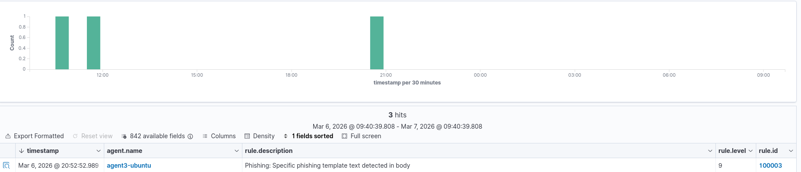
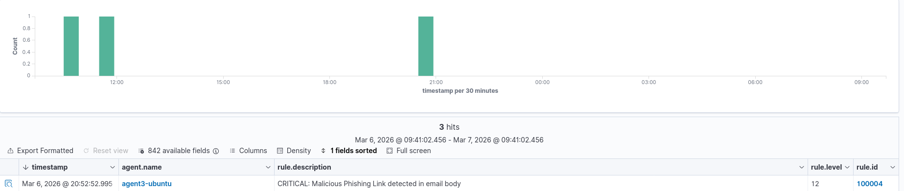
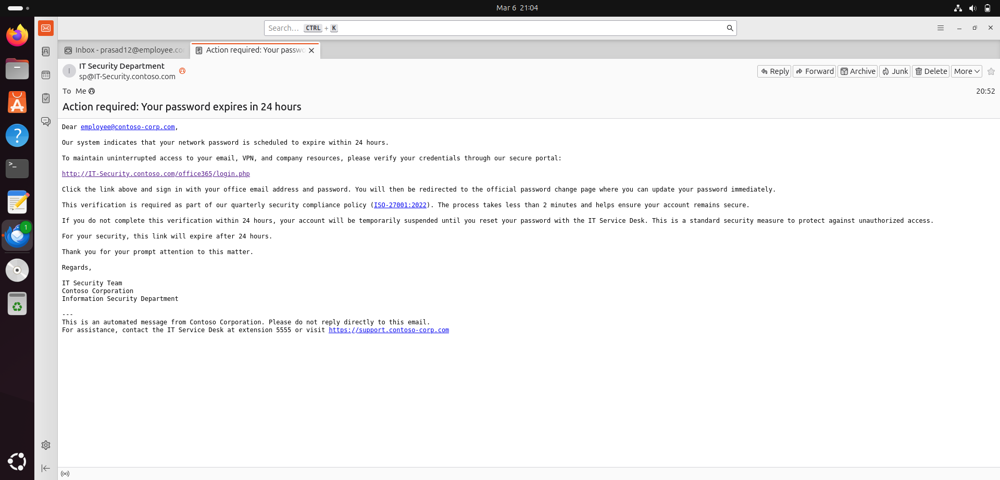
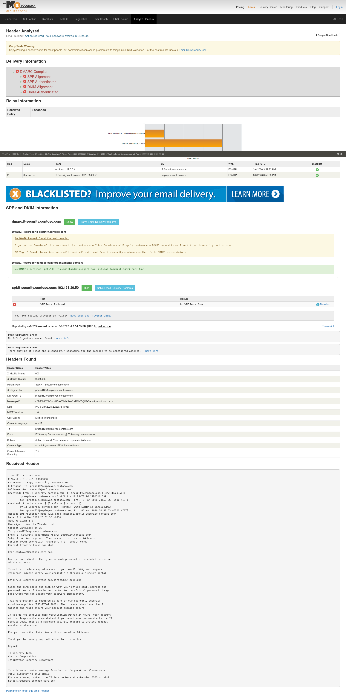
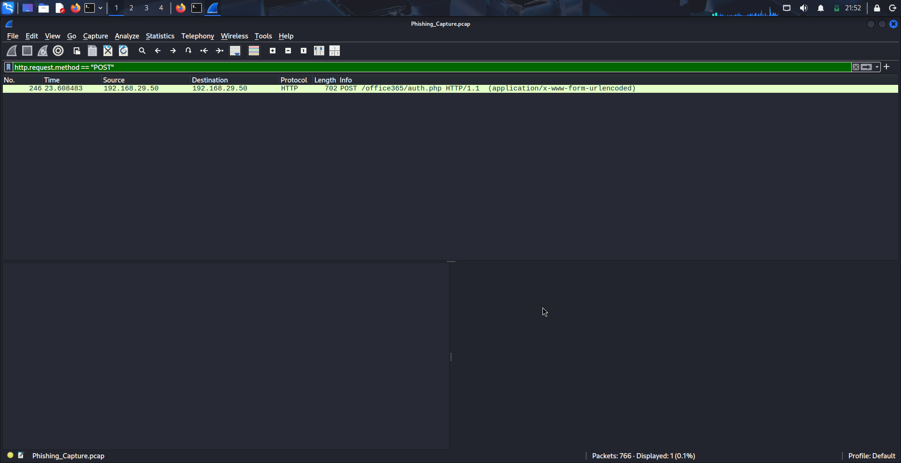
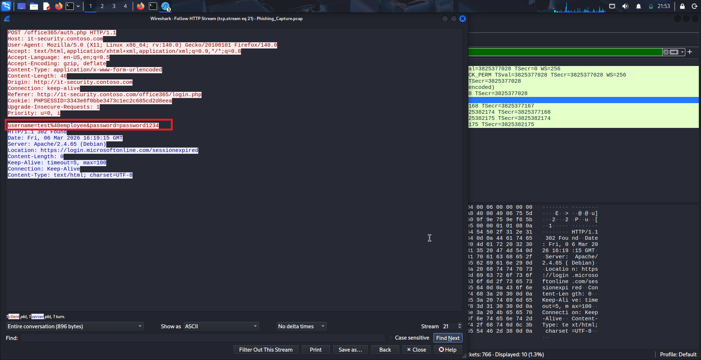
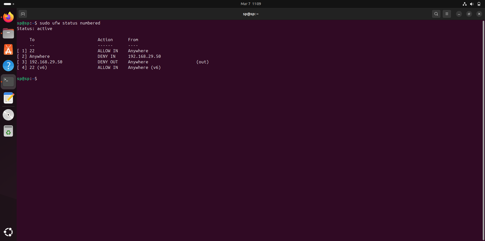

# End-to-End Phishing Incident Investigation: Credential Harvesting Attack Analysis

This project demonstrates a complete phishing incident investigation from detection to containment, simulating a credential harvesting attack in a controlled environment.

The investigation follows a structured incident response workflow using SIEM alert analysis, email header investigation, threat intelligence verification, and sandbox traffic analysis to confirm the attack and identify indicators of compromise (IOCs). The process includes validating email authentication mechanisms (SPF, DKIM, and DMARC), analyzing malicious infrastructure, and documenting containment actions taken to prevent potential credential compromise.

---

## Overview

This project replicates a realistic phishing attack scenario in a controlled lab environment. A targeted phishing email is sent from an attacker VM to a victim, triggering alerts in Wazuh SIEM. As the SOC analyst, the incident is analyzed using email header investigation, threat intelligence verification, and sandbox traffic analysis to confirm the phishing attack and implement containment within the defined SLA.

The investigation follows NIST Incident Response phases and maps techniques to the MITRE ATT&CK framework, providing a comprehensive learning experience for SOC analysts and incident responders.

---

## Lab Environment

The lab consists of four virtual machines on an isolated internal network:

| VM | Role | IP Address | OS | Key Tools |
|----|------|------------|-----|-----------|
| VM1 | Attacker | 192.168.29.50 | Kali Linux | Postfix, Dovecot, Thunderbird |
| VM2 | Victim | 192.168.29.90 | Ubuntu | Thunderbird, Dovecot, Wazuh Agent |
| VM3 | SIEM + Jira | 192.168.29.60 | Ubuntu | Wazuh Server, Jira |
| VM4 | Sandbox | 192.168.29.100 | Kali Linux | Wireshark, Firefox |

All VMs are connected via an internal network switch (192.168.29.0/24), isolated from external networks.

---

## Attack Scenario

A phishing email was crafted on the attacker VM and sent to the victim:

| Field | Value |
|------|------|
| From | IT Security Department <sp@IT-Security.contoso.com> |
| To | prasad12@employee.contoso.com |
| Subject | Action required: Your password expires in 24 hours |
| Link | http://IT-Security.contoso.com/office365/login.php |

The email uses social engineering (urgency around password expiry) to trick the victim into clicking a link to a fake Microsoft Office 365 login page designed to harvest credentials.

---

## Investigation Flow

```
Attacker VM → Victim VM → SIEM VM → Sandbox VM → SIEM VM → Case Closed
```

| Phase | Description |
|------|-------------|
| Attack | Attacker sends phishing email to victim |
| Detection | Wazuh SIEM triggers alerts upon email delivery |
| Investigation | SOC analyst analyzes headers, SPF/DKIM/DMARC, and threat intel |
| Sandbox | URL is analyzed in isolated sandbox with Wireshark |
| Containment | IOCs are blocked, email quarantined, user notified |
| Closure | Incident documented and ticket closed |

---

## Key Findings

| Finding | Result |
|-------|--------|
| Email Origin | 192.168.29.50 (attacker VM) |
| Domain Status | IT-Security.contoso.com created for this attack (no MX records) |
| SPF/DKIM/DMARC | ALL FAILED - definitive spoofing proof |
| URL Analysis | Confirmed credential harvesting page |
| User Interaction | Did NOT open or click |
| Credentials Compromised | None |
| Scope | Single targeted user |
| Containment Time | 33 minutes |
| SLA Met | Yes (within 2 hours) |

---

## MITRE ATT&CK Mapping

| Tactic | Technique ID | Technique Name | Observed Activity |
|------|---------------|---------------|-------------------|
| Initial Access | T1566.002 | Spearphishing Link | Targeted email with malicious link |
| Credential Access | T1056.001 | Input Capture | Fake login page harvesting credentials |
| Command and Control | T1071.001 | Web Protocols | HTTP POST for credential exfiltration |
| Exfiltration | T1041 | Exfiltration Over C2 Channel | Data sent to attacker server |

---

## Tools Used

| Tool | Purpose |
|------|--------|
| Wazuh SIEM | Alert detection and correlation |
| Wireshark | Network traffic analysis and evidence capture |
| MX Toolbox | Email header analysis |
| VirusTotal | Threat intelligence |
| Postfix / Dovecot | Email infrastructure |
| Thunderbird | Email client |
| Jira | Incident ticketing |

---

## Screenshots

### Alert Detection

Three Wazuh SIEM alerts triggered within seconds of email delivery.

### Wazuh Alert – Rule 100002 (Password Urgency Language)



### Wazuh Alert – Rule 100003 (Phishing Template Detected)



### Wazuh Alert – Rule 100004 (Malicious Link Detected)




### Phishing Email



### Header Analysis



### Sandbox Analysis





### Containment



---

## Indicators of Compromise (IOCs)

| Type | Value (Defanged) |
|------|------------------|
| IP Address | 192[.]168[.]29[.]50 |
| Domain | IT-Security[.]contoso[.]com |
| URL | hxxp[://]IT-Security[.]contoso[.]com/office365/login[.]php |
| Email Address | sp@IT-Security[.]contoso[.]com |
| Email Subject | Action required: Your password expires in 24 hours |
| Message ID | <5288b407-b6dc-429a-83b4-4fae5dd27b59@IT-Security[.]contoso[.]com> |
| Redirect URL | hxxp[://]IT-Security[.]contoso[.]com/office365/expired-password[.]html |

---

## Investigation Timeline

| Time | Event |
|------|------|
| 20:52:33 | Email composed on attacker VM |
| 20:52:36 | Email delivered to victim inbox |
| 20:52:52 | Wazuh triggers 3 alerts (100002, 100003, 100004) |
| 20:55 | Ticket opened, investigation begins |
| 21:00 | Header analysis confirms spoofing |
| 21:02 | SPF/DKIM/DMARC verification complete |
| 21:05 | Threat intelligence checks complete |
| 21:08 | Sandbox analysis confirms credential harvesting |
| 21:10 | IOCs extracted and documented |
| 21:15 | Scope determined - no compromise |
| 21:30 | Containment actions implemented |
| 22:30 | Investigation complete, ticket closed |

---

## Containment Actions

| Action | Time | Method |
|------|------|-------|
| Email quarantined | 20:57 | Moved to trash via Thunderbird |
| Sender blacklisted | 21:00 | Thunderbird message filter created |
| Domain DNS-blocked | 21:02 | /etc/hosts entry added |
| IP blocked at firewall | 21:05 | UFW rules applied |
| User password reset | 21:10 | Identity management system |
| Victim VM isolated | 21:15 | Network adapter disabled |
| URL proxy-blocked | 21:20 | Proxy blocklist updated |

---

## License

This project is licensed under the MIT License. See the LICENSE file for details.

---

## Contribution

This is a learning-focused project. Feel free to fork the repository and adapt it to your own training or educational requirements.
